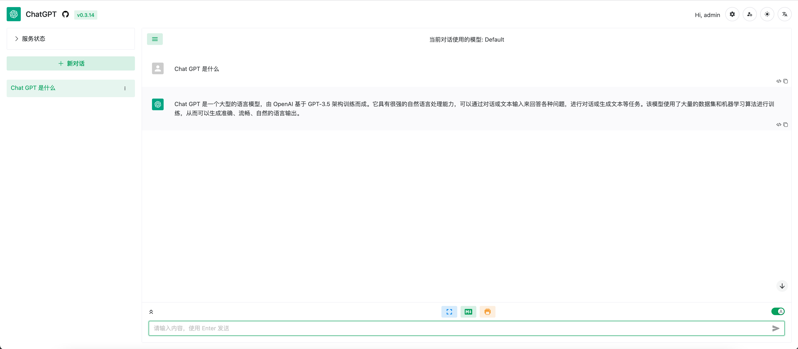

# SvipLab-ChatGPT-Web-Share

本项目目前为试运行阶段，主旨为共享一个 ChatGPT 账号给多用户同时使用。目前仅开放一个端口，后续视情况考虑开放多个端口，目前支持 GPT-3.5，GPT-4！

## 使用说明

### 项目地址

http://107.172.82.170:8080

### 申请使用权限

[【腾讯文档】SvipLab-ChatGPT-Web-Share](https://docs.qq.com/sheet/DWmdISUJkT2pBSGZt?tab=BB08J2)

### 根据分配账号密码登陆系统

默认账号，密码为邮箱前缀，登陆后请及时修改密码，忘记密码请联系管理员进行修改

### 新建对话，选择模型使用

目前由于Open AI官方限制，GPT-4 模型使用有次数限制（每3小时25条消息），请大家文明使用。为保证使用体验，希望大家优先选择default（GPT-3.5）模型（**建议先使用GPT-3.5理清逻辑，再使用GPT-4**）

## 声明

### 信息收集和隐私声明

我们保证不会使用和发布您的私人数据，除管理员需要定期查看系统使用状态外，用户之间彼此完全独立

### 使用声明

目前仅有一个端口可供使用，为保证使用体验，本项目仅供SVIP内部人员使用，账号请勿外借

### 风险声明

本项目仅供学习和研究使用，不鼓励用于商业用途。我们不对任何因使用本项目而导致的任何损失负责。
